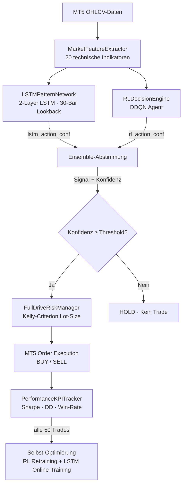

# AI-Fulldrive Mode – Technische Dokumentation

> **Modul:** `trading/ai_fulldrive_engine.py`  
> **Version:** 1.0.0  
> **Datum:** 2026-03-09

---

## 1. Überblick & Architektur

**AI-Fulldrive Mode** ist eine vollständig KI-gesteuerte Trading-Strategie für FinGPT-Ollama. Sie trifft alle Handelsentscheidungen autonom, ohne menschliche Intervention.



---

## 2. Komponenten

### 2.1 `MarketFeatureExtractor`

Berechnet und normalisiert **20 technische Indikatoren** zu einem Float32-Vektor:

| Index | Feature          | Skalierung        |
|-------|-----------------|-------------------|
| 0     | RSI-14           | 0–1               |
| 1–3   | MACD, Signal, Hist | tanh             |
| 4–5   | Bollinger Position, Breite | 0–1 / tanh |
| 6     | ATR-14 normiert  | tanh              |
| 7     | ADX-14           | 0–1               |
| 8–9   | Stochastik %K/%D | 0–1               |
| 10    | OBV-Rate         | tanh              |
| 11    | VWAP-Abstand     | tanh              |
| 12–14 | Preisänderung 1/5/20 Bars | tanh |
| 15    | Volumen-Verhältnis | tanh            |
| 16    | Trend-Stärke (EMA) | tanh            |
| 17    | EMA-50 Deviation | tanh              |
| 18    | High-Low Kanalposition | 0–1        |
| 19    | Handelssitzung   | 0/0.5/1 (Asia/London/NY) |

---

### 2.2 `LSTMPatternNetwork`

Zwei-schichtiges LSTM-Netz zur Sequenz-Mustererkennung:

```
Input:  (1, seq_len=30, features=20)
        ↓
LSTM(64 hidden, 2 layers, dropout=0.2)
        ↓
LayerNorm(64)
        ↓
Dense(64 → 32) + ReLU + Dropout(0.15)
        ↓
Output: (1, 3)  →  [HOLD, BUY, SELL] logits
```

**Inferenz:** `softmax(logits)` → `argmax` → Aktion + Konfidenz  
**Training:** Online-Backprop nach jedem abgeschlossenen Trade (Supervised Signal aus Trade-Ergebnis)

---

### 2.3 `RLDecisionEngine`

Ensemble-Kombination aus LSTM-Signal und DDQN-Agent:

| Szenario | Bedingung                         | Ergebnis          |
|----------|-----------------------------------|-------------------|
| Voll einig | LSTM = RL ≠ HOLD, Ø-Konfidenz ≥ threshold | Signal |
| Nur RL   | LSTM-Buffer < seq_len, RL-conf ≥ (threshold+0.05) | RL-Signal |
| Widerspruch | LSTM ≠ RL oder Konfidenz zu niedrig | HOLD    |

---

### 2.4 `FullDriveRiskManager`

#### Kelly-Kriterium

```
f* = (b × p − q) / b
```

- **b** = Durchschnittlicher Gewinn / Durchschnittlicher Verlust (Win/Loss-Ratio)  
- **p** = Win-Rate (Anteil Gewinn-Trades)  
- **q** = 1 − p  

**Angewendetes Kelly:** `f_eff = 0.5 × f*` (konservatives Halbes Kelly)  
**Clamp:** `[0.001, max_risk_fraction]`

#### Max-DD Guard

```
Drawdown = (Peak_Balance − Current_Balance) / Peak_Balance × 100
```

Wenn `Drawdown ≥ max_drawdown_pct (Standard: 15%)` → Keine neuen Positionen bis Recovery auf < 7.5%.

---

### 2.5 `PerformanceKPITracker`

| KPI | Formel |
|-----|--------|
| **Sharpe Ratio** | `(Ø_Rendite − risikofreier_Zinssatz) / σ(Renditen) × √252` |
| **Sortino Ratio** | `(Ø_Rendite − risikofreier_Zinssatz) / σ(neg.Renditen) × √252` |
| **Max Drawdown** | Maximaler Peak-to-Trough Rückgang in % (kumulativ) |
| **Annual Return Est.** | `(Gesamtrendite / Handelstage) × 252` |
| **Win Rate** | `Gewinntrades / Gesamt × 100` |
| **Profit Factor** | `Σ_Gewinne / Σ_Verluste` |

---

## 3. Performance-Ziele

| Kennzahl | Ziel | Hard Limit |
|----------|------|------------|
| Sharpe Ratio | ≥ 1.5 | — |
| Max Drawdown | ≤ 15% | 15% (Handelsstopp) |
| Annual Return | ≥ 25% | — |
| Min. Konfidenz | 70% (konfigurierbar) | — |

---

## 4. Selbst-Optimierung

Die Engine re-trainiert den RL-Agenten und die LSTM-Gewichte automatisch alle **50 abgeschlossenen Trades** in einem Hintergrund-Thread:

1. `RLTradingManager.retrain_from_experience(symbol)` – DDQN Experience Replay
2. `LSTMPatternNetwork.online_train_step(...)` – Supervised aus Trade-Ergebnissen
3. Modelle werden in `rl_models/fulldrive/` gespeichert

---

## 5. Backtesting-Protokoll

- **Methode:** Walk-Forward mit 80/20 Train/OOS-Split
- **Simulation:** RSI-Momentum-Proxy auf historischen MT5-Daten
- **Metriken:** Sharpe(OOS), Max-DD(OOS), Win-Rate(OOS), Profit%

```powershell
# Manueller Backtest-Aufruf (Python REPL)
from trading.ai_fulldrive_engine import AIFulldriveEngine
eng = AIFulldriveEngine(app)
results = eng.run_backtest("EURUSD", bars=2000)
print(results)
```

---

## 6. Risikoanalyse

| Risiko | Mitigation |
|--------|-----------|
| Overfitting LSTM | Walk-Forward OOS-Validierung + Dropout |
| KI-Modell korreliert mit Markt-Regime | ADX-Feature erkennt Trending vs. Ranging |
| Überorder bei niedriger Liquidität | Spread-Check + Volume-Ratio Feature |
| Konto-Burnout | Hard Max-DD Guard + Kelly-Fraction Clamp |
| MT5 offline | Graceful Fallback, kein Trade – kein Absturz |
| LSTM nicht bereit (< 30 Bars) | Fallback auf reinen DDQN mit erhöhtem Konfidenz-Limit |

> [!CAUTION]
> AI-Fulldrive Mode führt **echte Trades** aus, sobald Auto-Trading aktiviert ist. **Teste immer zuerst auf einem Demo-Konto.** Die Entwickler übernehmen keine Haftung für Handelsverluste.

---

## 7. Konfigurationsparameter

| Parameter | GUI-Element | Standard | Beschreibung |
|-----------|-------------|----------|-------------|
| `fulldrive_min_confidence` | Min. Konfidenz (%) Slider | 70 | Minimum Ensemble-Konfidenz für Trade-Ausführung |
| `fulldrive_sharpe_target` | Sharpe Ratio Ziel | 1.5 | Ziel-Sharpe (Info, kein Hard-Stop) |
| `fulldrive_max_drawdown` | Max. Drawdown Limit (%) | 15 | Hard-Stop Drawdown-Schwelle |
| `SELF_OPT_INTERVAL` | Code-Konstante | 50 | Trades zwischen Re-Training Sessions |

---

## 8. Tests

```powershell
cd "c:\Users\edgar\Desktop\FinGPT-Ollama-"
python -m pytest tests/test_ai_fulldrive.py -v
```

**Testfälle:**
- `TestMarketFeatureExtractor` – Shape, Dtype, Range, Robustheit bei < 30 Bars
- `TestFullDriveRiskManager` – Kelly-Fallback, Clamp-Bounds, DD-Guard, Lot-Berechnung
- `TestPerformanceKPITracker` – Sharpe, Win-Rate, Max-DD, Profit Factor, Leerer Zustand
- `TestLSTMPatternNetwork` – Buffer, Vorhersage-Shape, Aktions-Wertebereich
