# FinGPT Professional - Kompakte Header/Tab-Leiste Optimierung

## 📊 Aktuelle Situation (Vorher)

### Vertikale Platzverteilung:
```
┌─────────────────────────────────────────────────────┐
│ Title Bar (40px)                                   │
├─────────────────────────────────────────────────────┤
│ Header Frame (pady=15, ~70px)                      │
│   - Logo + "FinGPT Professional" (24px)            │
│   - Version-Label                                   │
│   - Live-Button                                     │
├─────────────────────────────────────────────────────┤
│ _ModernTabBar (height=45px, pady=10, ~55px)        │
│   - 12 Tabs mit langen Namen                       │
│   - Font: 13px                                      │
├─────────────────────────────────────────────────────┤
│ Tabview (pady=20) = 20px                            │
├─────────────────────────────────────────────────────┤
│ Status Bar (height=30, pady=30) = 60px             │
├─────────────────────────────────────────────────────┤
│ GESAMT "Chrome": ~275px (nur Rahmen!)              │
└─────────────────────────────────────────────────────┘
```

### Problemquellen:
1. **Header Frame**: `pady=(15, 15)` + große Font (24px) → ~70px
2. **_ModernTabBar**: `height=45` + `pady=(0, 10)` → ~55px
3. **Tab-Namen**: "📊 Dashboard", "📈 Charts" (zu lang)
4. **Version-Label**: Unnötiger Platzverbrauch
5. **Status Bar**: `pady=(0, 30)` → 60px

---

## 🎯 Optimierungsziele (Nachher)

### Zielgrößen:
- Header Frame: ~40px (statt ~70px) → **-43%**
- TabBar: ~38px (statt ~55px) → **-31%**
- Chrome gesamt: ~180px (statt ~275px) → **-35%**

### Mermaid-Diagramm - Neue Struktur:

```mermaid
graph TD
    A[Title Bar 40px] --> B[Compact Header + TabBar]
    B --> C[Content Area]
    C --> D[Status Bar]
    
    subgraph "Optimized Chrome (~180px)"
    B1[Header: 40px<br/>- Title inline<br/>- Kein Version-Label<br/>- Kompakter Live-Button]
    B2[TabBar: 38px<br/>- Icon-only Tabs<br/>- Font: 11px<br/>- Active Pill: 28px]
    end
    
    style A fill:#1A1D24,stroke:#333
    style B fill:#0B0E14,stroke:#00FF66,stroke-width:2px
    style C fill:#0B0E14,stroke:#333
    style D fill:#1A1D24,stroke:#333
```



---

## 🔧 Konkrete Änderungen

### 1. _ModernTabBar Klasse (Zeilen 101-227)

| Property | Aktuell | Neu | Differenz |
|----------|---------|-----|-----------|
| Frame height | 45px | 35px | -22% |
| Button height | 35px | 28px | -20% |
| Font size | 13px | 11px | -15% |
| Pill height | 35px | 28px | -20% |
| Pill position y | 5 | 3 | -2px |
| Grid padx | 3 | 2 | -1px |
| Grid pady | 5 | 3 | -2px |

**Icon-only Tabs:**
```python
# Alt:
"📊 Dashboard", "📈 Charts", "🎭 Debate", ...

# Neu (Icon + Kurzname):
"🏠 Dsh", "�� Charts", "🎭 Debate", "📉 Backtest", 
"🔥 Map", "💹 Trade", "📝 Journal", "📰 News",
"🤖 RL", "💻 Term", "⚙️ Config", "❓ FAQ"
```

ODER komplett Icon-only mit Tooltips:
```python
"🏠", "📈", "🎭", "📉", "🔥", "💹", "📝", "📰", "🤖", "💻", "⚙️", "❓"
```

### 2. Header Frame (setup_layout, Zeilen 514-551)

| Property | Aktuell | Neu | Differenz |
|----------|---------|-----|-----------|
| pady | (15, 15) | (5, 5) | -67% |
| Title font | 24px | 16px | -33% |
| Version label | Ja | Nein | -100% |
| Live-Button height | 40 (default) | 28 | -30% |
| Status dot size | 20px | 14px | -30% |

### 3. Tab Bar Grid Position (Zeile 569)

| Property | Aktuell | Neu | Differenz |
|----------|---------|-----|-----------|
| pady | (0, 10) | (0, 4) | -60% |

### 4. Tabview Grid Position (Zeile 585)

| Property | Aktuell | Neu | Differenz |
|----------|---------|-----|-----------|
| pady | (0, 20) | (0, 8) | -60% |

### 5. Status Bar Grid Position (Zeile 613)

| Property | Aktuell | Neu | Differenz |
|----------|---------|-----|-----------|
| pady | (0, 30) | (0, 10) | -67% |
| height | 30 | 24 | -20% |

---

## 📋 Implementierungs-Reihenfolge

1. **Phase 1: _ModernTabBar optimieren**
   - Height reduction
   - Font size reduction  
   - Icon-only tabs

2. **Phase 2: Header Frame optimieren**
   - Padding reduction
   - Title inline
   - Remove version

3. **Phase 3: Grid-Positionierungen**
   - Tab bar pady
   - Tabview pady
   - Status bar pady

---

## ✅ Checkliste für Copy-Paste Ready Code

- [ ] Neue _ModernTabBar Klasse mit kompakten Werten
- [ ] setup_layout() mit reduzierten Paddings
- [ ] _TAB_NAMES mit kürzeren Namen
- [ ] Live-Button mit kleinerer height
- [ ] Alle Stellen dokumentiert wo Änderungen nötig sind

---

## 📝 Notizen

- Die "grün leuchtenden" Tabs sind die aktiven Tabs (Pill mit #4B5563)
- Hover-Farben können angepasst werden zu grün (#00FF66)
- Für horizontales Scrolling bei Platzmangel: CTkScrollableFrame verwenden
