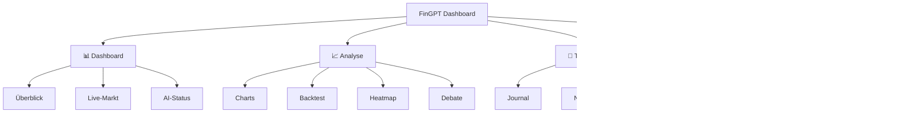
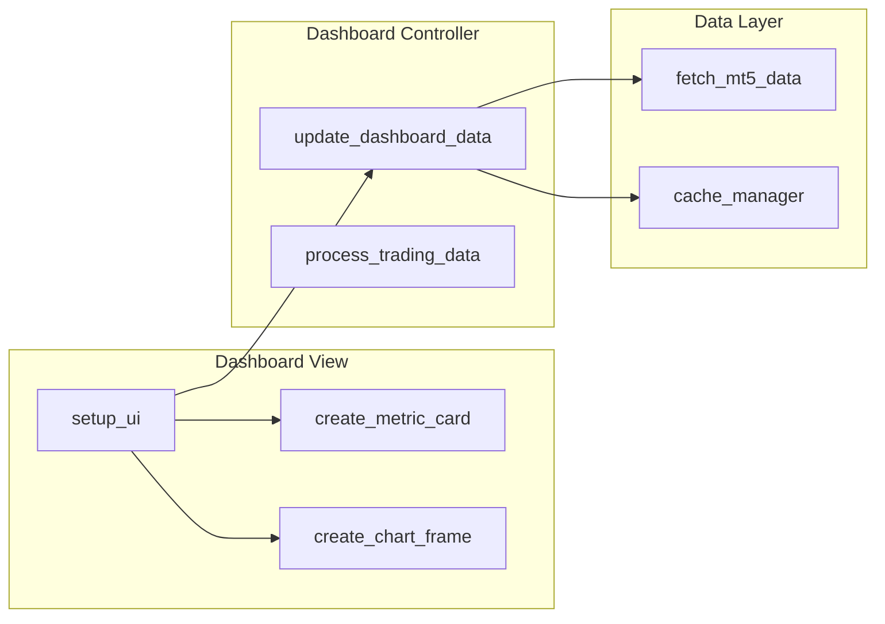

# FinGPT Dashboard Modernisierungsplan

## Übersicht

Dieser umfassende Modernisierungsplan basiert auf der Analyse der folgenden Dateien:
- `launch_gui.py` (2297 Zeichen)
- `gui/views/dashboard_tab.py` (15485 Zeichen)
- `gui/design_system.py` (16398 Zeichen)
- `gui/components/metric_card.py` (12179 Zeichen)
- `gui/components/live_data_row.py` (8903 Zeichen)
- `gui/modern_fingpt_gui.py` (87145 Zeichen)
- `plans/dashboard_overhaul_plan.md` (12118 Zeichen)
- `VISUELLE_VERBESSERUNGEN.md` (18658 Zeichen)

Der Plan deckt sechs Hauptbereiche ab: UI/UX-Verbesserungen, Performance-Optimierung, Code-Refactoring, neue Komponenten, Best Practices und modulare Architektur.

---

## 1. UI/UX-Verbesserungen

### 1.1 Hierarchische Navigation

**Aktuelle Struktur**: Horizontale "Pill"-Navigation mit 11 Tabs in einer einzigen Ebene

**Ziel**: Hierarchische Navigation mit Kategorien



**Begründung**: Die aktuelle flache Navigation mit 11 Tabs erschwert die Orientierung. Eine hierarchische Struktur verbessert die Benutzerführung erheblich.

**Umsetzung in [`gui/modern_fingpt_gui.py`](gui/modern_fingpt_gui.py:84)**:
- Kategorie-Gruppen als erste Navigationsebene
- Untertabs werden erst bei Klick auf eine Kategorie sichtbar
- Aktive Kategorie wird visuell hervorgehoben

### 1.2 Erweitertes Farbsystem

**Aktueller Zustand** ([`gui/design_system.py:21`](gui/design_system.py:21)):
- Primärfarbe: `#2E86AB`
- Begrenzte Farbpalette mit teilweise geringen Kontrasten

**Verbesserung**:
```python
# Farbschema für Trading-Status
COLORS = {
    'profit': '#27AE60',      # Positive P&L, BUY-Signale
    'loss': '#E74C3C',        # Negative P&L, SELL-Signale  
    'neutral': '#6C757D',     # HOLD-Signale, inaktive Elemente
    'warning': '#F39C12',     # Margin-Warnungen, Risiko-Limits
    'info': '#3498DB',        # Allgemeine Informationen
    'premium': '#9B59B6',     # AI-Features, Insights
}
```

**Begründung**: Ein konsistentes Farbschema verbessert die sofortige Erkennbarkeit von Handelszuständen und reduziert kognitive Belastung.

### 1.3 Typografie-Hierarchie

**Aktuelle Implementierung** ([`gui/design_system.py:79`](gui/design_system.py:79)):
```python
TYPOGRAPHY = {
    'sizes': {
        'xs': 11,   # Kleine Labels
        'sm': 13,   # Normale UI-Texte
        'base': 15, # Standard-Text
        'lg': 18,   # Überschriften
        'xl': 24,   # Große Metriken
        '2xl': 32,  # Hero-Texte
    }
}
```

**Verbesserung**: Monospace-Fonts (Consolas) nur für numerische Werte und Preise verwenden, nicht für normalen Text.

### 1.4 Dashboard-Header-Bereich

**Aktuelle Implementierung**: Metrik-Karten ohne klare Status-Anzeige

**Ziel-Layout**:
```
┌─────────────────────────────────────────────────────────────┐
│ 💹 FinGPT   │ Balance: €10,500 │ Equity: €10,650 │ ● LIVE │
└─────────────────────────────────────────────────────────────┘
```

**Elemente**:
- Logo und App-Name
- Live-Status-Indikator (grün/rot)
- Kontostand und Equity (zusammengefasst)
- Letzte Aktualisierungszeit

### 1.5 Verbesserte Metrik-Karten

**Aktuelle Karten** ([`gui/components/metric_card.py`](gui/components/metric_card.py)):
- Kontostand, Offene Positionen, Heutige Trades
- P&L, Margin Level, Freie Margin

**Verbesserungen**:
- Farbcodierung: Grün/Grün für positive Werte, Rot für negative
- Trend-Pfeile (▲/▼) mit Prozent-Änderung
- Mini-Sparklines im Hintergrund
- Hover-Effekte mit Details-Tooltip

### 1.6 AI-Status-Bereich

**Aktuelle Implementierung** ([`dashboard_tab.py:96`](gui/views/dashboard_tab.py:96)):
```python
self.app.ai_visualizer_frame = ctk.CTkFrame(...)
# Daily Goal Widget, AI Sonar Canvas, MVP Trade Widget
```

**Verbesserungen**:
- Animierte Fortschrittsbalken mit Glüheffekt
- AI-Sonar mit Puls-Animation
- Erweiterte Trade-Historie mit Gewinn/Verlust-Statistiken

---

## 2. Performance-Optimierung

### 2.1 Daten-Update-Architektur

**Aktuelle Implementierung** ([`modern_fingpt_gui.py:1500`](gui/modern_fingpt_gui.py:1500)):
```python
def _update_dashboard_data(self):
    # Direkte Updates ohne Throttling
    for symbol, row in self.live_data_rows:
        tick = mt5.symbol_info_tick(symbol)
        # ...
```

**Problem**: Kein Throttling, zu viele UI-Updates pro Sekunde

**Lösung: DataUpdateManager**
```python
class DataUpdateManager:
    """Zentralisiert Daten-Updates für das Dashboard"""
    
    def __init__(self, app):
        self.app = app
        self._update_queue = queue.Queue()
        self._last_positions = {}
        self._update_interval = 1000  # 1 Sekunde minimum
        
    def schedule_update(self, data_type: str, data: dict):
        """Plant Update mit Debouncing"""
        
    def _process_updates(self):
        """Verarbeitet Updates im Batch (max 10/sek)"""
```

**Update-Frequenzen**:
| Datenart | Update-Frequenz | Methode |
|----------|-----------------|---------|
| Preise/Ticks | Echtzeit (1s) | Push via MT5 callback |
| Positionen | Bei Änderung | Event-basiert |
| P&L | 5s | Batch-Update |
| AI-Signale | 30-300s | Config-Intervall |

### 2.2 Lazy Loading für Tabs

**Aktuelle Implementierung**: Alle Views werden bei App-Start initialisiert

**Problem**: Lange Ladezeit beim Start, viele ungenutzte Ressourcen

**Lösung**:
```python
class LazyTabLoader:
    """Lädt Tabs erst beim ersten Zugriff"""
    
    def __init__(self):
        self._loaded_tabs = {}
        
    def get_tab(self, tab_name: str):
        if tab_name not in self._loaded_tabs:
            self._loaded_tabs[tab_name] = self._load_tab(tab_name)
        return self._loaded_tabs[tab_name]
```

### 2.3 Caching für Sparklines

**Aktuelle Implementierung** ([`live_data_row.py:152`](gui/components/live_data_row.py:152)):
```python
def update_data(self, price, change, history=None):
    # Neue Berechnung bei jedem Update
    if history is not None:
        y = np.array(history)
        # ...
```

**Problem**: Sparkline-Daten werden bei jedem Update neu berechnet

**Lösung**:
- Caching der berechneten Sparkline-Grafiken
- Nur bei signifikanten Änderungen neu zeichnen
- Bitmap-Caching für unveränderte Charts

### 2.4 Thread-Isolation

**Aktuelle Implementierung** ([`modern_fingpt_gui.py:294`](gui/modern_fingpt_gui.py:294)):
```python
if ADVANCED_INDICATORS_AVAILABLE:
    self.advanced_indicators = AdvancedIndicators(logger=None)
    self.indicator_integration = IndicatorIntegration(self)
```

**Problem**: GUI-Operationen können aus Hintergrund-Threads aufgerufen werden

**Lösung**:
```python
def safe_ui_update(self, func, *args, **kwargs):
    """Führt UI-Updates sicher im Hauptthread aus"""
    self.after(0, lambda: func(*args, **kwargs))
```

---

## 3. Code-Refactoring

### 3.1 Modularisierung der Dashboard-Komponenten

**Aktuelle Struktur** ([`gui/views/dashboard_tab.py`](gui/views/dashboard_tab.py)):
- `setup_ui()`: 200+ Zeilen mit allen UI-Elementen
- `populate_sample_data()`: Vermischt mit UI-Logik
- `_rebuild_symbol_rows()`: Datenverarbeitung und UI gemischt

**Ziel**: Trennung von UI, Logik und Daten



### 3.2 Abstraktion der UI-Komponenten

**Aktuelle Implementierung** ([`dashboard_tab.py:88`](gui/views/dashboard_tab.py:88)):
```python
self.app.balance_card = self.create_metric_card(
    self.tab, "Kontostand", "€--", 0, 0, min_width=min_card_width
)
```

**Problem**: Wiederholter Code für ähnliche Komponenten

**Lösung: Factory-Pattern**
```python
class DashboardComponentFactory:
    """Fabrik für Dashboard-Komponenten"""
    
    @staticmethod
    def create_metric_cards(container, metrics: list[dict]):
        """Erstellt mehrere Metrik-Karten aus Konfiguration"""
        cards = {}
        for metric in metrics:
            card = MetricCard(
                container,
                title=metric['title'],
                value=metric.get('default', '---'),
                icon_type=metric.get('icon', 'default'),
                trend=metric.get('trend'),
                trend_value=metric.get('trend_value')
            )
            cards[metric['key']] = card
        return cards
```

### 3.3 Event-System für Daten-Updates

**Aktuelle Implementierung**: Direkte Methodenaufrufe

```python
# Aktuell
self.app.balance_card.update_value(new_value)
```

**Problem**: Starre Kopplung zwischen Komponenten

**Lösung: Event-Based Architecture**
```python
class DashboardEvents:
    """Event-Typen für Dashboard-Updates"""
    BALANCE_UPDATED = "balance_updated"
    POSITION_OPENED = "position_opened"
    POSITION_CLOSED = "position_closed"
    SIGNAL_GENERATED = "signal_generated"

class EventBus:
    """Zentraler Event-Bus für Dashboard"""
    
    def subscribe(self, event_type: str, callback):
        # ...
        
    def publish(self, event_type: str, data: dict):
        # ...
```

### 3.4 Konfigurations-Driven UI

**Aktuelle Implementierung**: Hardcodierte Werte in [`setup_ui()`](gui/views/dashboard_tab.py:66)

**Problem**: Änderungen erfordern Code-Anpassungen

**Lösung**:
```python
DASHBOARD_CONFIG = {
    'metrics': [
        {'key': 'balance', 'title': 'Kontostand', 'icon': 'balance'},
        {'key': 'positions', 'title': 'Offene Positionen', 'icon': 'positions'},
        # ...
    ],
    'symbols': ['EURUSD', 'GBPUSD', 'USDJPY', 'USDCHF'],
    'update_intervals': {
        'ticks': 1000,
        'positions': 5000,
        'signals': 30000
    }
}
```

---

## 4. Neue Dashboard-Komponenten

### 4.1 Trading-Journal-Übersicht

**Beschreibung**: Zusammenfassung der aktuellen Trading-Performance

**Elemente**:
- Gewinn/Verlust-Statistiken (täglich, wöchentlich, monatlich)
- Trade-Historie mit Gewinn/Verlust-Visualisierung
- Durchschnittliche Trade-Dauer
- Risiko/Belohnungs-Verhältnis

### 4.2 Economic Calendar Widget

**Beschreibung**: Anstehende Wirtschaftsnachrichten

**Elemente**:
- Kalenderansicht mit wichtigen Terminen
- Prioritätskennzeichen (niedrig, mittel, hoch)
- Marktauswirkungs-Prognose

### 4.3 Multi-Account Support

**Beschreibung**: Verwaltung mehrerer MT5-Konten

**Elemente**:
- Konto-Auswahl dropdown
- Konto-Status-Indikatoren
- Aggregierte oder getrennte Ansichten

### 4.4 Watchlist

**Beschreibung**: Benutzerdefinierte Symbol-Listen

**Elemente**:
- Schnellzugriff auf favorisierte Währungspaare
- Benutzerdefinierte Sortierung
- Preisalarme

### 4.5 Benachrichtigungssystem

**Beschreibung**: Toast-Benachrichtigungen für wichtige Ereignisse

```python
class NotificationManager:
    """Zentrales Benachrichtigungssystem"""
    
    NOTIFICATION_TYPES = {
        'critical': {'color': '#E74C3C', 'icon': '⛔', 'duration': 0},
        'warning': {'color': '#F39C12', 'icon': '⚠️', 'duration': 10000},
        'info': {'color': '#3498DB', 'icon': 'ℹ️', 'duration': 5000},
        'success': {'color': '#27AE60', 'icon': '✅', 'duration': 3000}
    }
    
    def show(self, message: str, notification_type: str = 'info'):
        # Toast-Notification
        # Status-Bar Update
        # Optional: Sound
```

---

## 5. Best Practices für Python GUI-Entwicklung

### 5.1 MVC-Pattern für Dashboard

```python
# Model: gui/models/dashboard_model.py
class DashboardModel:
    """Datenmodell für das Dashboard"""
    def __init__(self):
        self.balance = 0.0
        self.positions = []
        self.trades_history = []
        
# View: gui/views/dashboard_tab.py (existierend)
# Controller: gui/controllers/dashboard_controller.py (neu)

class DashboardController:
    """Controller für Dashboard-Logik"""
    
    def __init__(self, model: DashboardModel, view: DashboardView):
        self.model = model
        self.view = view
        
    def update_balance(self, new_balance):
        self.model.balance = new_balance
        self.view.update_balance_display(new_balance)
```

### 5.2 Context Manager für Ressourcen

```python
class MT5Connection:
    """Context Manager für MT5-Verbindungen"""
    
    def __enter__(self):
        if not mt5.initialize():
            raise MT5ConnectionError("Verbindung fehlgeschlagen")
        return self
        
    def __exit__(self, exc_type, exc_val, exc_tb):
        mt5.shutdown()
        
# Verwendung
with MT5Connection() as conn:
    # MT5-Operationen
    pass
```

### 5.3 Typed Exceptions

```python
class DashboardError(Exception):
    """Basis-Exception für Dashboard-Fehler"""
    pass

class MT5ConnectionError(DashboardError):
    """MT5-Verbindungsfehler"""
    pass

class DataUpdateError(DashboardError):
    """Fehler bei Daten-Updates"""
    pass
```

### 5.4 Logging-Integration

```python
import logging

class DashboardLogger:
    """Logging-Helper für Dashboard"""
    
    def __init__(self, name: str):
        self.logger = logging.getLogger(name)
        self.logger.setLevel(logging.DEBUG)
        
    def log_update(self, data_type: str, success: bool):
        level = logging.INFO if success else logging.ERROR
        self.logger.log(level, f"Dashboard Update: {data_type}")
```

### 5.5 Type Hints

```python
from typing import Optional, List, Dict, Any

def create_metric_card(
    parent,
    title: str,
    value: str,
    row: int,
    col: int,
    min_width: Optional[int] = None
) -> MetricCard:
    """Erstellt eine Metrik-Karte mit Typ-Annotationen"""
    ...
```

---

## 6. Modulare Architektur

### 6.1 Plugin-Architektur

```python
from abc import ABC, abstractmethod
from typing import List, Dict, Any

class DashboardPlugin(ABC):
    """Basisklasse für Dashboard-Plugins"""
    
    @abstractmethod
    def get_name(self) -> str:
        """Gibt den Namen des Plugins zurück"""
        pass
    
    @abstractmethod
    def get_metrics(self) -> List[MetricCard]:
        """Gibt die vom Plugin bereitgestellten Metriken zurück"""
        pass
    
    @abstractmethod
    def on_data_update(self, data: Dict[str, Any]):
        """Wird bei Daten-Updates aufgerufen"""
        pass
    
    @abstractmethod
    def get_panel(self) -> Optional[ctk.CTkFrame]:
        """Gibt ein optionales Panel zurück, das im Dashboard angezeigt wird"""
        return None


class PluginManager:
    """Verwaltet Dashboard-Plugins"""
    
    def __init__(self):
        self._plugins: Dict[str, DashboardPlugin] = {}
        
    def register(self, plugin: DashboardPlugin):
        self._plugins[plugin.get_name()] = plugin
        
    def get_all_metrics(self) -> List[MetricCard]:
        metrics = []
        for plugin in self._plugins.values():
            metrics.extend(plugin.get_metrics())
        return metrics
```

### 6.2 Dashboard-Modulstruktur

```
gui/
├── __init__.py
├── design_system.py          # Design-Tokens (existierend)
├── modern_fingpt_gui.py     # Hauptfenster (existierend)
├── factory/
│   ├── __init__.py
│   ├── component_factory.py  # Factory für UI-Komponenten
│   └── widget_factory.py    # Widget-Erstellung
├── controllers/
│   ├── __init__.py
│   ├── dashboard_controller.py
│   └── event_bus.py
├── models/
│   ├── __init__.py
│   ├── dashboard_model.py
│   └── trading_data.py
├── views/
│   ├── __init__.py
│   ├── dashboard_tab.py     # (existierend)
│   └── ... (andere Tabs)
├── plugins/
│   ├── __init__.py
│   ├── base.py
│   └── examples/
│       ├── __init__.py
│       └── economic_calendar.py
└── utils/
    ├── __init__.py
    ├── mt5_helper.py
    └── caching.py
```

### 6.3 Konfigurationsdateien für Erweiterungen

```json
// config/dashboard_layout.json
{
    "layout": {
        "header": {
            "show_balance": true,
            "show_equity": true,
            "show_connection_status": true
        },
        "metrics": {
            "columns": 3,
            "items": ["balance", "positions", "trades", "pnl", "winrate", "risk"]
        },
        "ai_visualizer": {
            "show_daily_goal": true,
            "show_sonar": true,
            "show_mvp": true
        },
        "live_data": {
            "symbols": ["EURUSD", "GBPUSD", "USDJPY"],
            "columns": ["symbol", "price", "change", "trend", "signal"],
            "update_interval_ms": 1000
        }
    }
}
```

### 6.4 Abhängigkeits-Injection

```python
class DashboardContainer:
    """Dependency Injection Container für Dashboard"""
    
    def __init__(self):
        self._services = {}
        
    def register(self, interface, implementation):
        self._services[interface] = implementation
        
    def resolve(self, interface):
        return self._services.get(interface)

# Verwendung
container = DashboardContainer()
container.register('MT5DataProvider', MT5DataProvider)
container.register('CacheManager', RedisCacheManager)

controller = DashboardController(
    model=container.resolve('DashboardModel'),
    data_provider=container.resolve('MT5DataProvider')
)
```

---

## 7. Implementierungs-Roadmap

### Phase 1: Foundation (Kurzfristig)
- [ ] Design-System erweitern mit neuen Farben und Typografie
- [ ] Event-Bus implementieren
- [ ] DataUpdateManager mit Throttling

### Phase 2: Dashboard Core (Mittelfristig)
- [ ] Metrik-Karten überarbeiten mit verbesserter UI
- [ ] Live-Daten-Tabelle optimieren
- [ ] P&L Chart mit Zoom/Pan
- [ ] Dashboard Controller implementieren

### Phase 3: Integration (Mittelfristig)
- [ ] TradingController → Dashboard Bridge
- [ ] Echtzeit-Updates vollständig implementieren
- [ ] Fehlerbehandlung verfeinern

### Phase 4: Erweiterungen (Langfristig)
- [ ] Plugin-Architektur einführen
- [ ] Economic Calendar Widget
- [ ] Multi-Account Support
- [ ] Benachrichtigungssystem

---

## Zusammenfassung

Dieser Modernisierungsplan bietet einen strukturierten Ansatz zur Verbesserung des FinGPT-Dashboards:

1. **UI/UX-Verbesserungen**: Hierarchische Navigation, erweitertes Farbsystem, verbesserte Typografie
2. **Performance-Optimierung**: Throttling, Lazy Loading, Caching, Thread-Isolation
3. **Code-Refactoring**: MVC-Pattern, Factory-Pattern, Event-System, Konfigurations-Driven UI
4. **Neue Komponenten**: Trading-Journal, Economic Calendar, Multi-Account, Watchlist, Benachrichtigungen
5. **Best Practices**: Typed Exceptions, Logging, Type Hints, Context Manager
6. **Modulare Architektur**: Plugin-System, DI-Container, Konfigurationsdateien

Die Implementierung sollte in iterativen Phasen erfolgen, beginnend mit den Grundlagen (Design-System, Event-Bus) und dann schrittweise zu komplexeren Features übergehen.