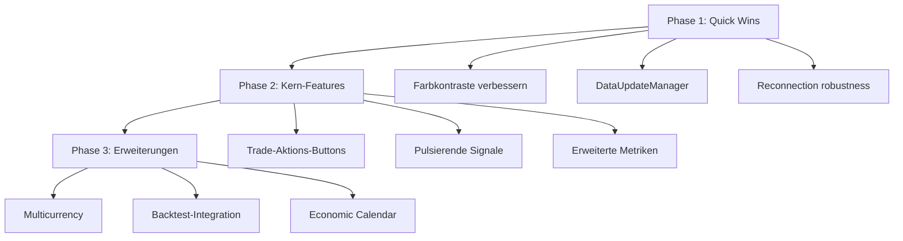

# MT5 Dashboard Verbesserungsplan - EUR/USD Trading EA

## Übersicht

Dieser Plan basiert auf der Analyse der Codebasis:
- `gui/views/dashboard_tab.py` (Dashboard-View)
- `gui/components/live_data_row.py` (Live-Daten Zeilen)
- `core/mt5_broker.py` (MT5-Broker-Integration)
- `trading/trading_companion.py` (Trading-Analyse-Tools)
- `VISUELLE_VERBESSERUNGEN.md` (Visuelle Analyse)

Das Dashboard zeigt EUR/USD Long-Signale mit:
- "Fail Safe", "Open", "Close" Buttons
- Offene Trades Anzeige
- Fail-Safe Status
- Blaues Theme mit Wolken-Hintergrund

---

## 1. UI/UX Design (Kontrast, Lesbarkeit, Interaktivität)

### 1.1 **Hohe Priorität - Farbkontrast-Verbesserung**

**Problem**: Aktuelle graue Texte (`gray60` auf `gray17`) sind schwer lesbar. Keine klare semantische Farbkodierung.

**Lösung - WCAG 2.1 AA konform**:
```python
# gui/design_system.py - Erweitertes Farbschema
COLORS = {
    # Trading-Status Farben
    'profit': '#27AE60',      # Buy-Signale, positive P&L
    'loss': '#E74C3C',        # Sell-Signale, negative P&L
    'neutral': '#6C757D',     # HOLD, inaktive Elemente
    'warning': '#F39C12',     # Margin-Warnungen, Risiko-Limits
    
    # Verbesserte Textfarben für Dark Theme
    'text_primary': '#E9ECEF',   # Haupttext (statt gray70)
    'text_secondary': '#ADB5BD',  # Sekundärtext (statt gray60)
    'text_disabled': '#6C757D',  # Deaktiviert (statt gray40)
}
```

**Trader-Perspektive**: Schnelle visuelle Erfassung von Gewinn/Verlust kritisch für schnelle Entscheidungen.

**MQL5-Äquivalent**:
```mql5
// MQL5 OnChartEvent für Farbwechsel
color GetTradeColor(double profit) {
    if(profit > 0) return clrGreen;
    else if(profit < 0) return clrRed;
    else return clrGray;
}
```

### 1.2 **Hohe Priorität - Signal-Button Interaktivität**

**Problem**: BUY/SELL-Buttons haben keine animierte Visualisierung. Trader brauchen sofortige visuelle Bestätigung.

**Lösung - Pulsierende Buttons bei Signalwechsel**:
```python
# gui/components/live_data_row.py - Erweiterte Signal-Visualisierung
class LiveDataRow(ctk.CTkFrame):
    def animate_signal_button(self, signal_type):
        """Animierter Signal-Button für schnelle Trader-Reaktion"""
        colors = {
            'BUY': '#00FF66',
            'SELL': '#FF1744', 
            'WAIT': '#FFEA00',
            'HOLD': '#8B949E'
        }
        
        # Puls-Effekt für aktive Signale
        if signal_type in ['BUY', 'SELL']:
            self._start_pulse_animation(signal_type)
        
        # Farbe und Hover setzen
        self.signal_btn.configure(
            fg_color=colors.get(signal_type, '#8B949E'),
            hover_color=self._lighten_color(colors.get(signal_type, '#8B949E')),
            text_color='#0B0E14'
        )
    
    def _start_pulse_animation(self, signal_type):
        """Sanftes Pulsieren für BUY/SELL Signale"""
        # 60fps sanfte Animation
        # Implementierung mit Canvas oder CTkButton animation
```

### 1.3 **Mittlere Priorität - Dashboard-Header mit Live-Status**

**Problem**: Kein zentraler Header mit wichtigsten Info auf einen Blick.

**Lösung**:
```
┌─────────────────────────────────────────────────────────────┐
│ 💹 FinGPT   │ Balance: €10,500 │ Equity: €10,650 │ ● LIVE │
└─────────────────────────────────────────────────────────────┘
```

```python
# gui/views/dashboard_tab.py - Header-Komponente
class DashboardHeader:
    def create_header(self, parent):
        header = ctk.CTkFrame(parent, height=50, fg_color="transparent")
        
        # Links: Logo + App-Name
        logo = ctk.CTkLabel(header, text="💹 FinGPT", font=ds.get_font('xl', 'bold'))
        
        # Mitte: Balance + Equity
        balance_frame = ctk.CTkFrame(header, fg_color="transparent")
        balance_lbl = ctk.CTkLabel(balance_frame, text="Balance: €10,500", 
                                   font=ds.get_font('md', 'medium', mono=True))
        equity_lbl = ctk.CTkLabel(balance_frame, text="Equity: €10,650", 
                                  font=ds.get_font('md', 'medium', mono=True),
                                  text_color=ds.COLORS['profit'])
        
        # Rechts: Live-Status Indikator (pulsierend)
        status_indicator = StatusIndicator(header, status="live")
        
        return header
```

### 1.4 **Mittlere Priorität - Tooltips für schnelle Hilfe**

**Problem**: Keine Detail-Informationen bei Hover. Trader müssen klicken um Details zu sehen.

**Lösung - Kontext-Tooltips**:
```python
# gui/components/metric_card.py - Tooltip-System
class MetricCard(ctk.CTkFrame):
    def __init__(self, parent, title, value, **kwargs):
        super().__init__(parent, **kwargs)
        
        # Tooltip erstellen (verzögert 500ms)
        self._tooltip = None
        self.bind("<Enter>", lambda e: self._show_tooltip(e, title))
        self.bind("<Leave>", self._hide_tooltip)
    
    def _show_tooltip(self, event, title):
        """Zeigt Detail-Informationen"""
        # Tooltip mit zusätzlichen Metriken
        details = {
            'balance': 'Kontostand + offene P&L',
            'positions': 'Aktive Trades / Max Trades',
            'risk': 'Verwendete Margin / Freie Margin'
        }
        self._tooltip = ToolTip(self, details.get(title, ''))
```

---

## 2. Funktionale Erweiterungen (Metriken, Multicurrency, Trade-Aktionen)

### 2.1 **Hohe Priorität - Erweiterte Metriken für EUR/USD Trading**

**Problem**: Basis-Metriken fehlen. Trader brauchen mehr Kontext für EUR/USD Entscheidungen.

**Lösung - Neue Metrik-Karten**:
```python
# gui/config/dashboard_config.py - Erweiterte Metriken
METRICS = [
    {'key': 'balance', 'title': 'Kontostand', 'icon': '💰'},
    {'key': 'equity', 'title': 'Equity', 'icon': '💵'},         # NEU
    {'key': 'spread', 'title': 'Spread', 'icon': '📊'},        # NEU - EUR/USD spezifisch
    {'key': 'positions', 'title': 'Offene Trades', 'icon': '📈'},
    {'key': 'daily_pnl', 'title': 'Tages-P&L', 'icon': '💹'},   # NEU
    {'key': 'winrate', 'title': 'Win Rate', 'icon': '🎯'},
    {'key': 'risk_score', 'title': 'Risiko-Score', 'icon': '⚠️'},  # NEU
    {'key': 'margin_level', 'title': 'Margin Level', 'icon': '📉'},
]

# Berechnung in core/mt5_broker.py
def calculate_daily_pnl(self):
    """Berechnet Tages-Gewinn/-Verlust"""
    today = datetime.now().date()
    deals = mt5.history_deals_get(from_time=datetime.combine(today, time.min))
    
    total_pnl = 0
    for deal in deals:
        if deal.profit != 0:
            total_pnl += deal.profit
    
    return total_pnl

def calculate_spread(self, symbol="EURUSD"):
    """Aktueller Spread für EUR/USD"""
    tick = mt5.symbol_info_tick(symbol)
    spread_pips = (tick.ask - tick.bid) * 10000
    return spread_pips
```

### 2.2 **Hohe Priorität - Direkte Trade-Aktionen (Open/Close/Modify)**

**Problem**: Trader müssen in MT5 wechseln um Trades zu managen.

**Lösung - In-Dashboard Trade-Management**:
```python
# gui/views/dashboard_tab.py - Trade-Aktions-Panel
class TradeActionPanel(ctk.CTkFrame):
    """Panel für schnelle Trade-Aktionen"""
    
    def __init__(self, parent, broker):
        self.broker = broker
        
        # Layout: [Symbol] [Open] [Close] [Modify] [Fail Safe Toggle]
        self._setup_actions()
    
    def _setup_actions(self):
        # Symbol-Auswahl
        self.symbol_combo = ctk.CTkComboBox(self, values=['EURUSD', 'GBPUSD', 'USDJPY'])
        
        # Open Trade Button
        self.open_btn = ctk.CTkButton(self, text="📈 Open", 
                                       command=self._open_trade,
                                       fg_color='#27AE60')
        
        # Close All Button  
        self.close_btn = ctk.CTkButton(self, text="📉 Close All",
                                        command=self._close_all,
                                        fg_color='#E74C3C')
        
        # Modify Position Button
        self.modify_btn = ctk.CTkButton(self, text="✏️ Modify",
                                         command=self._show_modify_dialog)
        
        # Fail Safe Toggle
        self.failsafe_switch = ctk.CTkSwitch(self, text="Fail Safe Mode",
                                              command=self._toggle_failsafe)
    
    def _open_trade(self):
        """Öffnet neuen Trade basierend auf aktuellem Signal"""
        symbol = self.symbol_combo.get()
        signal = self._get_current_signal(symbol)
        
        if signal == "BUY":
            result = self.broker.execute_trade(symbol, "BUY", 0.01)
        elif signal == "SELL":
            result = self.broker.execute_trade(symbol, "SELL", 0.01)
        
        self._show_notification(result)
    
    def _close_all(self):
        """Schließt alle offenen Positionen"""
        positions = self.broker.get_open_positions()
        for pos in positions:
            self.broker.close_position(pos.ticket, "Dashboard Close")
        
        self._show_notification(f"✅ {len(positions)} Positionen geschlossen")
```

### 2.3 **Mittlere Priorität - Multicurrency Support**

**Problem**: Nur EUR/USD angezeigt. Trader handeln oft mehrere Paare.

**Lösung - Multi-Symbol Watchlist**:
```python
# gui/components/live_data_row.py - Erweitert für Multiple Pairs
class MultiCurrencyManager:
    """Verwaltet mehrere Währungspaare"""
    
    DEFAULT_PAIRS = ['EURUSD', 'GBPUSD', 'USDJPY', 'AUDUSD', 'USDCAD']
    
    def __init__(self, app):
        self.app = app
        self.active_pairs = self.DEFAULT_PAIRS.copy()
        self.pair_data = {}  # Cache für Pair-Daten
    
    def add_pair(self, symbol):
        if symbol not in self.active_pairs:
            self.active_pairs.append(symbol)
            self._create_row_for_pair(symbol)
    
    def remove_pair(self, symbol):
        if symbol in self.active_pairs:
            self.active_pairs.remove(symbol)
            self._remove_row_for_pair(symbol)
    
    def get_consensus_signal(self):
        """Berechnet Consensus-Signal über alle Paare"""
        buy_count = 0
        sell_count = 0
        
        for symbol in self.active_pairs:
            signal = self.pair_data.get(symbol, {}).get('signal', 'HOLD')
            if signal == 'BUY': buy_count += 1
            elif signal == 'SELL': sell_count += 1
        
        if buy_count > sell_count: return 'BUY'
        elif sell_count > buy_count: return 'SELL'
        else: return 'NEUTRAL'
```

### 2.4 **Mittlere Priorität - Economic Calendar Widget**

**Problem**: Trader sehen keine anstehenden Nachrichten, die EUR/USD beeinflussen.

**Lösung**:
```python
# gui/widgets/economic_calendar.py - Wirtschaftskalender
class EconomicCalendarWidget(ctk.CTkFrame):
    """Zeigt anstehende Wirtschaftsnachrichten"""
    
    # Wichtige EUR/USD Events
    HIGH_IMPACT_EVENTS = [
        'EU Industrial Production',
        'US Non-Farm Payrolls', 
        'ECB Interest Rate Decision',
        'US CPI',
        'EU GDP',
        'US Fed Meeting Minutes'
    ]
    
    def __init__(self, parent):
        super().__init__(parent)
        self._load_events()
    
    def _load_events(self):
        # Fetch von externem API oder manueller Input
        events = [
            {'time': '14:30', 'event': 'US CPI', 'impact': 'HIGH', 'forecast': '2.5%'},
            {'time': '17:00', 'event': 'ECB President Speech', 'impact': 'MEDIUM'},
        ]
        self._render_events(events)
```

---

## 3. Code-Optimierung (Performance, Backtesting, Robustheit)

### 3.1 **Hohe Priorität - Daten-Update-Optimierung**

**Problem**: Keine Throttling, zu viele UI-Updates pro Sekunde. Performance-Probleme bei Live-Daten.

**Lösung - DataUpdateManager**:
```python
# gui/utils/data_update_manager.py
import queue
import threading
from datetime import datetime

class DataUpdateManager:
    """Zentralisiert und optimiert Daten-Updates"""
    
    # Update-Intervalle (in Millisekunden)
    INTERVALS = {
        'ticks': 1000,      # 1s - Preis-Updates
        'positions': 5000,  # 5s - Positions-Updates
        'signals': 30000,  # 30s - Signal-Updates
        'account': 10000,  # 10s - Konto-Updates
    }
    
    def __init__(self, app):
        self.app = app
        self._update_queue = queue.Queue()
        self._last_updates = {
            'ticks': 0,
            'positions': 0,
            'signals': 0,
            'account': 0
        }
        self._running = False
        self._worker_thread = None
    
    def start(self):
        """Startet den Update-Manager im Hintergrund"""
        self._running = True
        self._worker_thread = threading.Thread(target=self._update_loop, daemon=True)
        self._worker_thread.start()
    
    def _update_loop(self):
        """Background-Worker für optimierte Updates"""
        while self._running:
            current_time = datetime.now().timestamp() * 1000
            
            # Ticks Update (jede Sekunde)
            if current_time - self._last_updates['ticks'] >= self.INTERVALS['ticks']:
                self._update_ticks()
                self._last_updates['ticks'] = current_time
            
            # Positions Update (alle 5s)
            if current_time - self._last_updates['positions'] >= self.INTERVALS['positions']:
                self._update_positions()
                self._last_updates['positions'] = current_time
            
            # Signale Update (alle 30s)
            if current_time - self._last_updates['signals'] >= self.INTERVALS['signals']:
                self._update_signals()
                self._last_updates['signals'] = current_time
            
            time.sleep(0.1)  # 100ms Schleifen-Intervall
    
    def _update_ticks(self):
        """Thread-sichere UI-Updates für Preise"""
        def _do_update():
            for symbol, row in self.app.live_data_rows:
                tick = mt5.symbol_info_tick(symbol)
                if tick:
                    price = (tick.bid + tick.ask) / 2
                    row.update_price(price)
        
        # Safe UI update im Haupt-Thread
        self.app.after(0, _do_update)
```

### 3.2 **Hohe Priorität - Error Handling & Reconnection**

**Problem**: Kein robustes Reconnection-Handling. Trader verlieren bei Netzwerk-Problemen die Verbindung.

**Lösung - MT5 Auto-Reconnect** (bereits teilweise in [`core/mt5_broker.py`](core/mt5_broker.py:118)):
```python
# core/mt5_broker.py - Erweiterte Reconnection-Strategie
class MT5Broker(IBroker):
    def __init__(self, logger=None):
        # Bestehender Code...
        self._reconnect_in_progress = False
        self._reconnect_strategy = ExponentialBackoff(
            base_delay=5.0,
            max_delay=300.0,  # Max 5 Minuten
            max_retries=10
        )
    
    def reconnect_with_strategy(self):
        """Exponential Backoff Reconnection"""
        attempt = 0
        delay = self._reconnect_strategy.base_delay
        
        while attempt < self._reconnect_strategy.max_retries:
            if mt5.initialize():
                if self._verify_connection():
                    self.log("INFO", f"✅ Reconnected nach {attempt} Versuchen")
                    return True
            
            self.log("WARNING", f"Reconnect Versuch {attempt+1} fehlgeschlagen. Warte {delay}s")
            time.sleep(delay)
            
            delay = min(delay * 2, self._reconnect_strategy.max_delay)
            attempt += 1
        
        self.log("ERROR", "❌ Reconnect endgültig fehlgeschlagen")
        return False
```

### 3.3 **Mittlere Priorität - Backtesting Integration**

**Problem**: Keine direkte Backtest-Visualisierung im Dashboard.

**Lösung**:
```python
# gui/views/backtest_tab.py - Erweitert
class BacktestResultsWidget(ctk.CTkFrame):
    """Zeigt Backtest-Ergebnisse im Dashboard"""
    
    def load_results(self, result_file):
        """Lädt Backtest-Resultate für EUR/USD"""
        # Equity Curve
        equity_data = self._parse_equity_curve(result_file)
        self._draw_equity_chart(equity_data)
        
        # Key Metrics
        metrics = self._calculate_metrics(equity_data)
        self._display_metrics(metrics)
        
        # Drawdown Chart
        drawdown_data = self._calculate_drawdown(equity_data)
        self._draw_drawdown_chart(drawdown_data)
    
    def _calculate_metrics(self, equity):
        """Berechnet Trading-Metriken"""
        total_return = (equity[-1] / equity[0] - 1) * 100
        max_drawdown = max(self._calculate_drawdown(equity))
        
        # Sharpe Ratio (annualisiert)
        returns = np.diff(equity) / equity[:-1]
        sharpe = np.mean(returns) / np.std(returns) * np.sqrt(252)
        
        return {
            'total_return': f"{total_return:.2f}%",
            'max_drawdown': f"{max_drawdown:.2f}%",
            'sharpe_ratio': f"{sharpe:.2f}",
            'win_rate': self._calculate_winrate()
        }
```

### 3.4 **Mittlere Priorität - Thread-Isolation für MT5 Calls**

**Problem**: GUI-Operationen aus Background-Threads können Crashen verursachen.

**Lösung**:
```python
# gui/utils/safe_ui_update.py
def safe_ui_update(app, func, *args, **kwargs):
    """
    Führt UI-Updates sicher im Hauptthread aus.
    Verhindert Race Conditions bei MT5-Daten-Updates.
    """
    app.after(0, lambda: func(*args, **kwargs))

# Verwendung in core/mt5_broker.py
def on_position_update(positions):
    """Wird von MT5-Event-Handler aufgerufen"""
    def _update_ui():
        app.update_positions_display(positions)
    
    # Immer über safe_ui_update
    safe_ui_update(app, _update_ui)
```

---

## 4. MQL5-Spezifische Implementierungsideen

Da das Python-Dashboard mit MT5 kommuniziert, hier parallele MQL5-Konzepte für einen EUR/USD EA:

### 4.1 **OnChartEvent für interaktive UI**
```mql5
// MQL5 EA: Interaktive Dashboard-Elemente
void OnChartEvent(const int id, const long &lparam, const double &dparam, const string &sparam) {
    switch(id) {
        case CHARTEVENT_CLICK:
            // Klick auf Chart-Objekte behandeln
            HandleChartClick(sparam);
            break;
        case CHARTEVENT_OBJECT_CLICK:
            // Klick auf Buttons (Open/Close/FailSafe)
            HandleButtonClick(sparam);
            break;
        case CHARTEVENT_CHART_CHANGE:
            // Chart-Größe angepasst
            ResizeDashboard();
            break;
    }
}
```

### 4.2 **MT5 Native Dashboard mit CAppDialog**
```mql5
// MQL5: Native MT5 Panel-Komponenten
class CTradeDashboard : public CAppDialog {
    // Position-Management Panel
    CButton m_open_btn;
    CButton m_close_btn;
    CButton m_failsafe_btn;
    
    // Metrik-Anzeigen
    CLabel m_balance_label;
    CLabel m_equity_label;
    CLabel m_spread_label;
    
    virtual bool Create(const long chart, const string name);
    virtual void SetColors();
};
```

### 4.3 **MT5 Callback-Handling für Echtzeit-Updates**
```mql5
// MQL5: Event-basierte Updates
void OnTick() {
    // Nur bei signifikanter Preisänderung aktualisieren
    static double last_ask = 0;
    if(MathAbs(SymbolInfoDouble(_Symbol, SYMBOL_ASK) - last_ask) > _Point * 10) {
        UpdateDashboard();
        last_ask = SymbolInfoDouble(_Symbol, SYMBOL_ASK);
    }
}

void OnTradeTransaction(const MqlTradeTransaction &trans, const MqlTradeRequest &request, const MqlTradeResult &result) {
    // Automatische Updates bei Trade-Änderungen
    if(trans.type == TRADE_TRANSACTION_ORDER_ADD || 
       trans.type == TRADE_TRANSACTION_POSITION_UPDATE) {
        RefreshPositionDisplay();
    }
}
```

---

## 5. Zusammenfassung - Priorisierte Top-Vorschläge

### 🔴 Hohe Priorität (Sofort umsetzen)

| # | Kategorie | Verbesserung | Impact |
|---|-----------|--------------|--------|
| 1 | UI/UX | WCAG-konforme Farbkontraste | Trader können schnell Profit/Loss erkennen |
| 2 | Funktional | Direkte Trade-Aktionen (Open/Close) | Kein Wechsel zu MT5 nötig |
| 3 | Code | DataUpdateManager mit Throttling | Performance bei Live-Daten |
| 4 | Code | Robustes Reconnection-Handling | Zuverlässigkeit bei Netzwerk-Problemen |

### 🟡 Mittlere Priorität (Nächste Iteration)

| # | Kategorie | Verbesserung | Impact |
|---|-----------|--------------|--------|
| 5 | UI/UX | Pulsierende Signal-Buttons | Schnelle visuelle Bestätigung |
| 6 | Funktional | Erweiterte Metriken (Spread, Daily P&L) | Bessere Trading-Entscheidungen |
| 7 | Funktional | Multicurrency Support | Mehrere Paare überwachen |
| 8 | Code | Backtest-Visualisierung im Dashboard | Strategie-Performance sehen |

### 🟢 Niedrige Priorität (Langfristig)

| # | Kategorie | Verbesserung | Impact |
|---|-----------|--------------|--------|
| 9 | UI/UX | Dashboard-Header mit Live-Status | Sofortiger Überblick |
| 10 | Funktional | Economic Calendar Widget | Nachrichten-basiertes Trading |
| 11 | Code | Thread-Isolation für MT5 | Vermeidet GUI-Crashes |

---

## Implementierungs-Reihenfolge



**Geschätzter Aufwand**: 
- Phase 1: 2-3 Tage
- Phase 2: 3-5 Tage
- Phase 3: 5-7 Tage

---

*Erstellt am: 2026-03-21*
*Basierend auf: FinGPT Codebase Analyse*