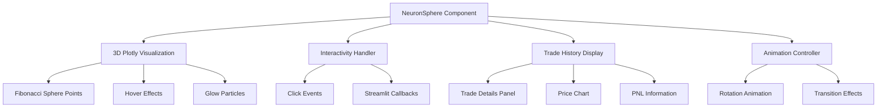

# Interaktive 3D-Neuronen-Kugel Komponente - Implementierungsplan

## 📋 Anforderungen

**Ziel:** Interaktive 3D-Neuronen-Kugel für das FinGPT News Tab Dashboard

**Spezifikationen:**
- ✅ Mindestens 500 neuronale Punkte in sphärischer Anordnung
- ✅ Interaktive Punkte: Klick zeigt vollständigen Handelsverlauf
- ✅ Hover-Effekte und Smooth-Transition-Animationen
- ✅ Dark Theme kompatibel
- ✅ Streamlit-Integration

---

## 🏗️ Architektur

### Dateistruktur
```
gui/components/
└── neuron_sphere.py    # Hauptkomponente (NEU)
```

### Komponentenübersicht



---

## 🔧 Implementierungsdetails

### 1. Fibonacci Sphere Algorithmus
Gleichmäßige Punktverteilung auf der Kugeloberfläche:

```python
phi = math.pi * (3. - math.sqrt(5.))  # Golden Angle
for i in range(n):
    y = 1 - (i / float(n - 1)) * 2
    radius = math.sqrt(1 - y * y)
    theta = phi * i
    x = math.cos(theta) * radius
    z = math.sin(theta) * radius
```

### 2. Punkt-Datenstruktur
Jeder Neuronen-Punkt speichert:
- `id`: Eindeutige ID
- `x, y, z`: 3D Koordinaten
- `trade_data`: Handelsverlaufs-Dictionary
- `sentiment`: Bullish/Bearish/Neutral
- `impact`: HIGH/MEDIUM/LOW
- `size`: Punktgröße (basierend auf Wichtigkeit)

### 3. Interaktivität

**Hover-Effekt:**
- Farbwechsel zu hellerem Blau
- Größe nimmt zu
- Tooltip mit: Titel, Zeit, Sentiment

**Klick-Event:**
- Öffnet Slide-out Panel
- Zeigt vollständigen Trade-Verlauf
- Smooth Transition Animation

### 4. Dark Theme Farben

```python
COLORS = {
    "background": "#0E1117",      # Streamlit Dark
    "primary": "#2979FF",         # Blau
    "neuron_glow": "#00BFFF",    # Deep Sky Blue
    "neuron_core": "#4A90D9",    # Mittleres Blau
    "particle": "#E0E0E0",       # Weiß
    "bullish": "#4CAF50",       # Grün
    "bearish": "#F44336",        # Rot
    "neutral": "#FFC107",        # Gelb
    "text": "#FAFAFA",           # Weiß
    "text_secondary": "#8B949E"  # Grau
}
```

---

## 📦 Streamlit Integration

### Hauptfunktion
```python
def render_neuron_sphere(
    trade_data: List[Dict],
    container: st.container,
    on_click_callback: callable
) -> None
```

### Session State Management
```python
if "selected_neuron" not in st.session_state:
    st.session_state.selected_neuron = None

if "sphere_rotation" not in st.session_state:
    st.session_state.sphere_rotation = 0
```

### Callback-Handling
```python
def on_neuron_click(neuron_id: str):
    st.session_state.selected_neuron = neuron_id
    # Zeige Trade History Panel
```

---

## 📊 Trade History Panel

### Struktur bei Klick
```
┌────────────────────────────────────────────┐
│  📊 Trade Details - Neuron #42             │
├────────────────────────────────────────────┤
│  Zeit: 2024-03-15 14:30:00                 │
│  Signal: 🟢 BULLISH                        │
│  Impact: 🔴 HIGH                           │
├────────────────────────────────────────────┤
│  Entry Price:  1.0892                      │
│  Exit Price:   1.0945                      │
│  PnL:          +53 pips (+0.49%)           │
│  Duration:     4h 23m                     │
├────────────────────────────────────────────┤
│  [Price Chart - Entry bis Exit]            │
│  ┌──────────────────────────────────────┐  │
│  │      📈                              │  │
│  └──────────────────────────────────────┘  │
├────────────────────────────────────────────┤
│  [Schließen]                               │
└────────────────────────────────────────────┘
```

---

## 🎨 Animationen

### Rotation
- Auto-rotate: 360° in 30 Sekunden
- Geschwindigkeit: `auto_rotate=True`
- Rotation kann pausiert werden bei Hover

### Hover-Transition
- Duration: 200ms
- Easing: ease-out
- Größe: 1.0 → 1.5
- Opacity: 0.7 → 1.0

### Klick-Transition
- Duration: 400ms
- Slide-in von rechts
- Hintergrund: blur(10px)

---

## ✅ Checkliste

- [ ] Fibonacci Sphere Algorithmus implementiert
- [ ] 500+ neuronale Punkte generiert
- [ ] Dark Theme Farben konfiguriert
- [ ] Hover-Effekte implementiert
- [ ] Klick-Event Handler erstellt
- [ ] Trade History Panel designed
- [ ] Streamlit Integration
- [ ] Smooth Transition Animationen
- [ ] Performance optimiert (30+ FPS)

---

## 🚀 Implementierungsreihenfolge

1. **Basis-Klasse**: NeuronSphere mit Fibonacci Punkten
2. **Visualisierung**: Plotly 3D Scatter mit Glow
3. **Interaktivität**: Click/Hover Events
4. **Trade Panel**: Details Overlay
5. **Animation**: Rotation + Transitions
6. **Integration**: In Streamlit News Tab einbauen

---

## 📝 Code-Übersicht

### gui/components/neuron_sphere.py
```python
# Geschätzte Zeilen: ~350
# Klassen:
# - NeuronSphere: Hauptkomponente
# - TradeHistoryPanel: Detailansicht
# - AnimationController: Rotation/Transitions

# Hauptfunktionen:
# - generate_fibonacci_sphere_points()
# - render_sphere()
# - handle_click()
# - show_trade_details()
```
