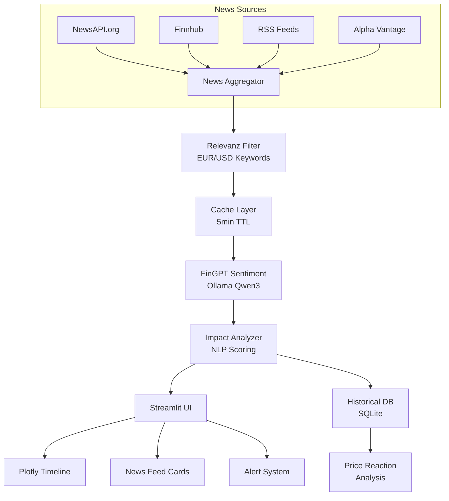

# FinGPT Streamlit News-Tab Plan

## 📋 Projektübersicht

**Projektname:** FinGPT Professional News Dashboard (Streamlit)
**Ziel:** Echtzeit Trading News Intelligence für EUR/USD und andere Major Währungspaare
**Zielmarkt:** Deutsche Trader (EUR als Hauptwährung)

---

## 🎯 Must-Have Features (300 Zeilen max)

### 1. Live News Feed (Priority 1)
- **FinGPT Sentiment Analysis**: 🟢Bullish / 🟡Neutral / 🔴Bearish
- **Filter nach Currency**: EUR/USD, GBP/USD, USD/JPY, USD/CHF
- **Real-time Sources**: NewsAPI.org + Finnhub + RSS (Alpha Vantage)
- **Auto-Refresh**: Alle 60 Sekunden mit Streamlit rerun()

### 2. Smart Filtering & Impact (Priority 2)
- **Impact Score**: High/Medium/Low (Zentralbanken, GDP, NFP, CPI)
- **EUR/USD Relevance Scoring**: NLP + Keyword Matching
- **News Timeline**: Letzte 24h mit Plotly Timeline
- **Click → Chart Jump**: Navigation zu relevantem Chart

### 3. Trading Intelligence (Priority 3)
- **"Impact on EUR/USD" Prediction**: FinGPT LLM (Ollama Qwen3)
- **Historical Impact Database**: News → Price Reaction Speicherung
- **Alert Button**: "News affects current Signal?"
- **Export**: CSV mit Sentiment Scores

---

## 🏗️ Architektur



---

## 📁 Dateistruktur

```
gui/views/
├── news_tab_streamlit.py    # Hauptkomponente (~300 Zeilen)
└── news_tab.py              # Bestehender CustomTkinter (bleibt)

plans/
└── plan_news_tab.md         # Dieses Dokument

docs/
└── news_api_setup.md       # API Key Setup Anleitung
```

---

## 🔧 Technische Spezifikationen

### Dependencies
```text
streamlit>=1.28.0
requests>=2.31.0
pandas>=2.1.0
plotly>=5.18.0
feedparser>=6.0.0
numpy>=1.24.0
```

### API Keys (Environment Variables)
```bash
NEWSAPI_KEY=your_key           # newsapi.org
FINNHUB_API_KEY=your_key       # finnhub.io
ALPHA_VANTAGE_KEY=your_key     # alphavantage.co
OLLAMA_URL=http://localhost:11434
```

### Cache Strategie
- **TTL**: 5 Minuten für News-Daten
- **Session State**: Für aktuelle Filter und Analysen
- **Memory**: Max 100 News-Items im Cache

---

## 📊 UI Layout (Streamlit)

```
┌─────────────────────────────────────────────────────────────┐
│  📰 EUR/USD News Intelligence                    [🔄 Auto] │
├─────────────────────────────────────────────────────────────┤
│  [EUR/USD ▼] [GBP/USD ▼] [USD/JPY ▼]  [Impact: Alle ▼]    │
├─────────────────────────────────────────────────────────────┤
│  ┌──────────────┐  ┌────────────────────────────────────┐  │
│  │ EUR/USD      │  │  📈 Impact Timeline (24h)         │  │
│  │ Bullish 65%  │  │  [Plotly Gantt Chart]             │  │
│  │ Signal: 🟢   │  │                                     │  │
│  └──────────────┘  └────────────────────────────────────┘  │
├─────────────────────────────────────────────────────────────┤
│  ┌─────────────────────────────────────────────────────┐    │
│  │ 🔴 HIGH IMPACT │ ECB Rate Decision │ 14:30 CET     │    │
│  │ 🟢 Bullish → EUR/USD +15 pips expected             │    │
│  │ [View Chart] [Alert] [Export]                       │    │
│  └─────────────────────────────────────────────────────┘    │
│  ┌─────────────────────────────────────────────────────┐    │
│  │ 🟡 MED IMPACT │ US CPI Data │ 13:30 CET           │    │
│  │ 🟡 Neutral → No significant move expected         │    │
│  └─────────────────────────────────────────────────────┘    │
├─────────────────────────────────────────────────────────────┤
│  Last Update: 14:25:03 CET | Next: 14:26:03 | Cache: 4:58 │
└─────────────────────────────────────────────────────────────┘
```

---

## 🔄 Datenfluss

### 1. News Fetching
```python
# Pseudocode
def fetch_news():
    # Parallele API-Aufrufe
    newsapi_news = fetch_newsapi()
    finnhub_news = fetch_finnhub()
    rss_news = fetch_rss_feeds()
    
    # Aggregation und Deduplikation
    all_news = merge_and_dedupe([newsapi_news, finnhub_news, rss_news])
    
    # Relevance Scoring für EUR/USD
    scored_news = score_relevance(all_news, target_currency="EUR/USD")
    
    return cache_news(scored_news, ttl=300)
```

### 2. Sentiment Analysis (FinGPT)
```python
# Ollama Qwen3 für Sentiment
def analyze_sentiment(news_text):
    prompt = f"""Analysiere das Sentiment für EUR/USD:
    {news_text}
    Antworte mit: BULLISH, BEARISH oder NEUTRAL"""
    
    response = ollama.chat(model="qwen3", messages=[{"role": "user", "content": prompt}])
    return parse_sentiment(response)
```

### 3. Impact Prediction
```python
def predict_impact(news_item, current_price):
    # Keyword-basiert + FinGPT
    keywords = detect_keywords(news_item)  # ECB, NFP, GDP, etc.
    base_impact = keyword_impact_map[keywords]
    
    # FinGPT Verfeinerung
    gpt_impact = ollama.chat(model="qwen3", 
        messages=[{"role": "user", 
                   "content": f"Predict EUR/USD price impact: {news_item}"}])
    
    return combine_impact(base_impact, gpt_impact)
```

---

## 📋 Implementierungs-Reihenfolge

1. **Basis-Setup**
   - Streamlit App Struktur erstellen
   - API-Client Klassen für NewsAPI, Finnhub, RSS
   - Cache-Manager implementieren

2. **News Feed**
   - Fetch-Funktionen für alle Quellen
   - Relevance Scoring Engine
   - UI: News Cards mit Sentiment

3. **Intelligence Features**
   - FinGPT Sentiment Integration
   - Impact Analyzer
   - Historical Database

4. **Erweiterungen**
   - Plotly Timeline
   - CSV Export
   - Alert System
   - Auto-Refresh

---

## ✅ Akzeptanzkriterien

- [ ] News laden aus mindestens 3 Quellen
- [ ] Sentiment-Analyse zeigt 🟢/🟡/🔴
- [ ] Filter nach Währung funktioniert
- [ ] Impact Score wird angezeigt
- [ ] Auto-Refresh alle 60s
- [ ] Timeline Chart mit Plotly
- [ ] CSV Export mit Sentiment Scores
- [ ] Cache funktioniert (5min TTL)
- [ ] Dunkles Theme (Streamlit dark)
- [ ] Deutsche UI-Labels

---

## 📝 Notizen

- Das bestehende CustomTkinter Dashboard bleibt erhalten
- Streamlit kann als Alternative/Option gestartet werden
- Ollama muss lokal laufen für FinGPT Features
- Fallback auf Mock-Daten wenn keine API-Keys
